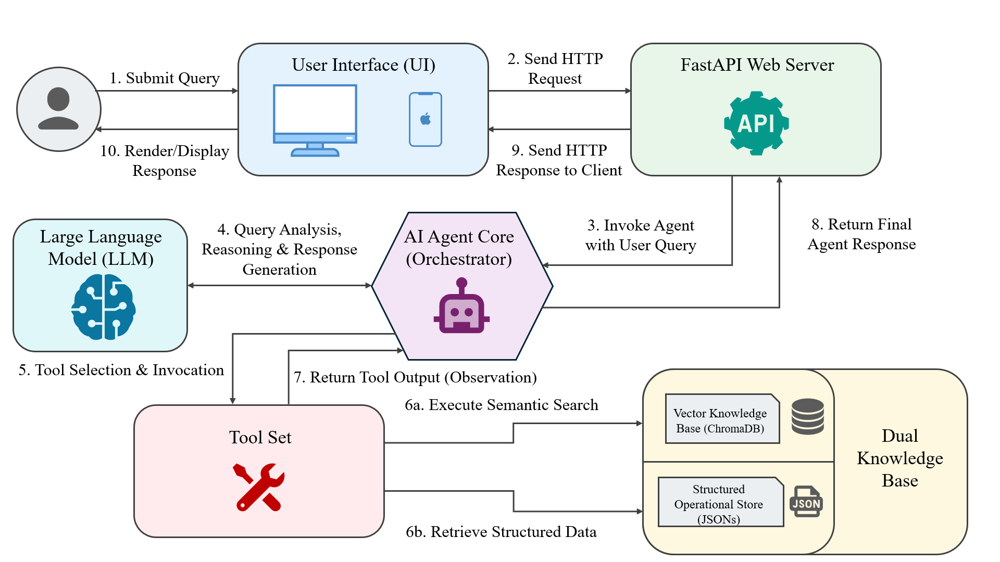
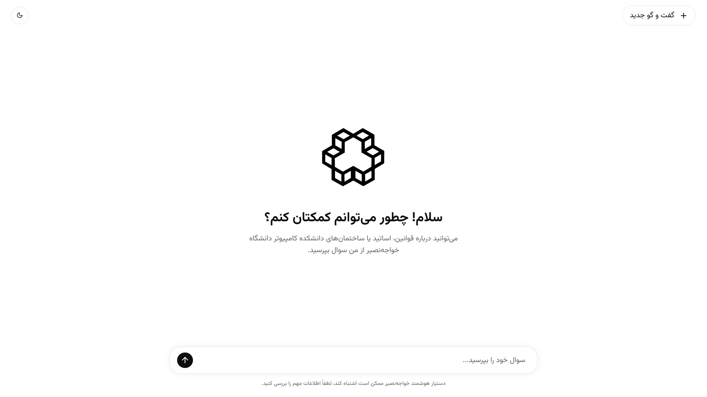
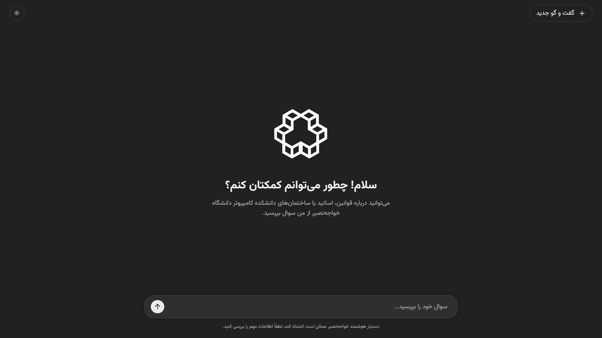
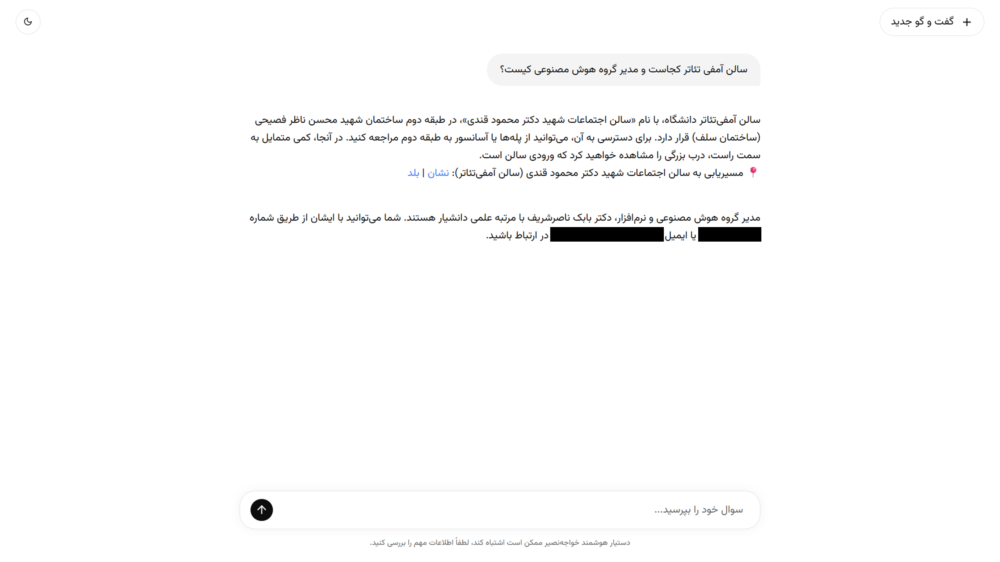
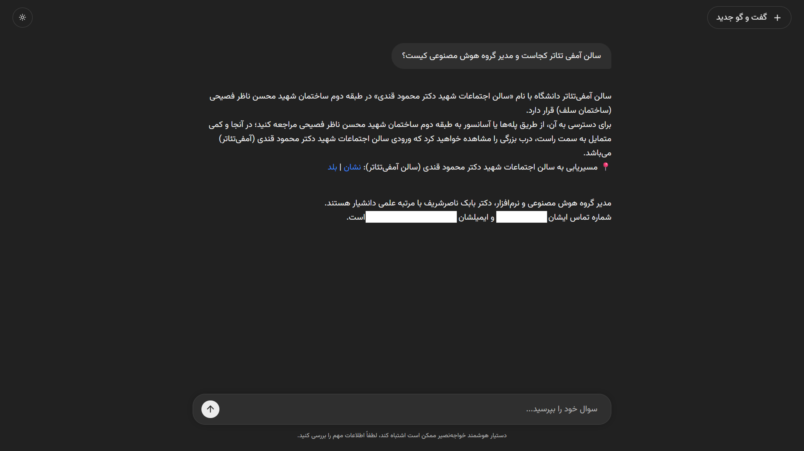

# Agent-Tool Hybrid RAG Assistant for Academic Question Answering


An intelligent academic assistant developed as an undergraduate thesis project for the Computer Engineering Department at K. N. Toosi University of Technology.

The system combines an **Agent-Tool architecture** with a **Hybrid Retrieval-Augmented Generation (RAG)** pipeline to answer students' academic questions using both structured and unstructured knowledge sources.

Instead of relying solely on semantic search, the assistant dynamically selects specialized tools for operational queries (such as courses, professors, study plans, or administrative staff) while using a Hybrid RAG pipeline for educational regulations and policy documents. This approach improves factual accuracy, reduces hallucinations, and enables transparent access to university information.

> **Note**
>
> This public repository contains a **sanitized demonstration version** of the original thesis project.
> Sensitive institutional data, personal contact information, internal links, and location-specific details have been replaced with representative mock data while preserving the overall architecture and functionality.

---

## Architecture

The following diagram illustrates the overall architecture of the system.

<p align="center">
  
</p>

The assistant follows an **Agent-Orchestrator** design. Incoming user requests are analyzed by a Large Language Model, which decides which specialized tool (or combination of tools) should be invoked. Depending on the query, information is retrieved either from structured JSON knowledge bases or through a Hybrid RAG pipeline built on ChromaDB and BM25.

---

## User Interface

The application provides a lightweight responsive interface with support for both **Light** and **Dark** themes.

### Home Screen

| Light Mode | Dark Mode |
|------------|-----------|
|  |  |

### Example Conversation

| Light Mode | Dark Mode |
|------------|-----------|
|  |  |

> Personal information such as phone number and email address shown in the original system has been anonymized in these screenshots.

---

## Key Features

- Agent-Orchestrator architecture for intelligent tool selection
- Hybrid Retrieval-Augmented Generation (Semantic Search + BM25)
- FastAPI backend with modular service architecture
- Structured operational knowledge base using JSON
- Semantic retrieval powered by ChromaDB embeddings
- Automatic query normalization for Persian language
- Context-aware multi-tool reasoning
- Hallucination reduction through retrieval grounding
- Responsive web interface with Light and Dark themes
- Modular design for extending tools and knowledge sources

---

## Dataset

One of the main contributions of this project was the creation of a comprehensive academic knowledge base.

Unlike typical RAG demonstrations that rely only on publicly available documents, this project required collecting, organizing, and structuring information from multiple heterogeneous sources, including:

- Educational regulations
- Course catalogues
- Faculty members
- Administrative staff
- Department organizational roles
- Campus facilities
- Building navigation information
- Study plans
- Official university services

A significant portion of the location-related data was collected manually through on-site inspection and documentation.

For privacy reasons, this repository includes only a representative subset of the original datasets used during the research.

| Dataset | Original Thesis | Public Repository |
|----------|----------------:|------------------:|
| Buildings | 8 | 4 |
| Rooms & Facilities | 112 | 12 |
| Courses | 48 | 8 |
| Professors | 27 | 4 |
| Administrative Staff | 9 | 3 |
| Organization Roles | 7 | 4 |
| Official Links | 20 | 4 |
| Study Plans | Complete | Simplified |

## Evaluation

The architecture was evaluated through both quantitative and qualitative experiments conducted as part of the undergraduate thesis.

### Quantitative Results

| Metric | Result |
|--------|--------:|
| Tool Selection Accuracy | **98.6%** |
| End-to-End Successful Responses | **96%** |
| RAG Faithfulness | **4.40 / 5** |
| Answer Relevance | **4.49 / 5** |

### Key Findings

- High accuracy in selecting the appropriate tool for operational queries.
- Reliable handling of multi-intent questions through parallel tool execution.
- Robust retrieval performance using a hybrid semantic + lexical search strategy.
- Clear separation between reasoning (LLM Agent) and deterministic execution (Tool Layer), improving reliability and reducing hallucinations.
- Low operational cost achieved through the use of **Gemini 2.5 Flash**.

These results demonstrate that combining an LLM-based agent with deterministic software tools provides significantly more reliable behavior than relying solely on a language model.

---

## Technologies

- **Backend:** Python, FastAPI
- **LLM:** Gemini 2.5 Flash
- **Embeddings:** Sentence Transformers (paraphrase-multilingual-MiniLM-L12-v2)
- **RAG Pipeline:** ChromaDB (Semantic Search), Rank-BM25 (Lexical Search)
- **Frontend:** HTML, CSS, JavaScript

## Project Structure

```text
.
├── app/
│   ├── api/                 # FastAPI routes
│   ├── core/                # Configuration
│   ├── schemas/             # Pydantic schemas
│   └── services/
│       ├── chunker.py
│       ├── intent_detector.py
│       ├── normalizer.py
│       ├── retriever.py
│       └── vectorizer.py
│
├── data/                    # Public mock datasets
│
├── frontend/
│   ├── css/
│   ├── js/
│   └── assets/
│
├── images/                  # README assets
│
├── requirements.txt
├── .env.example
└── main.py
```

## Prerequisites

- Python 3.12+ (tested on Python 3.12.1)

## Installation

Clone the repository:

```bash
git clone https://github.com/Mm-Naseri/academic-agent-rag.git
cd academic-agent-rag
```

Create a virtual environment:

```bash
python -m venv .venv
```

Activate it.

Windows:

```bash
.venv\Scripts\activate
```

Linux / macOS:

```bash
source .venv/bin/activate
```

Install dependencies:

```bash
pip install -r requirements.txt
```

## Environment Variables

Create a `.env` file based on `.env.example`.

Example:

```env
GEMINI_API_KEY=your_api_key
```

The API key is required for the LLM Agent to communicate with the Gemini API.

---

## Running the Project

### 1. Normalize the regulations

```bash
python app/services/normalizer.py
```

Generates:

```
data/Rules_normalized.txt
```

### 2. Split the regulations into chunks

```bash
python app/services/chunker.py
```

Generates:

```
data/Rules_chunks.json
```


### 3. Build the vector database

```bash
python app/services/vectorizer.py
```

Creates the local **ChromaDB** vector store.

> The generated `chroma_db/` directory is intentionally excluded from version control and must be built locally.


### 4. Run the application

Launch the development server:

```bash
uvicorn main:app --reload
```

The application will be available at:

| Service | URL |
|---------|-----|
| Application | http://127.0.0.1:8000 |
| Swagger UI | http://127.0.0.1:8000/docs |

---

## Notes

- This repository contains a public demonstration version of the original thesis implementation.
- Sensitive institutional information has been anonymized.
- The ChromaDB vector database is intentionally excluded from version control and can be regenerated locally using the provided preprocessing scripts.

## Acknowledgements

This project was developed as part of an undergraduate thesis at K. N. Toosi University of Technology.

I would like to thank my thesis supervisor for their guidance throughout this research and the staff of the Computer Engineering Department for their support during data collection and system evaluation.

## License

This project is licensed under the MIT License.

## Contact

**Mohammadmahdi Naseri**
- GitHub: <https://github.com/Mm-Naseri>